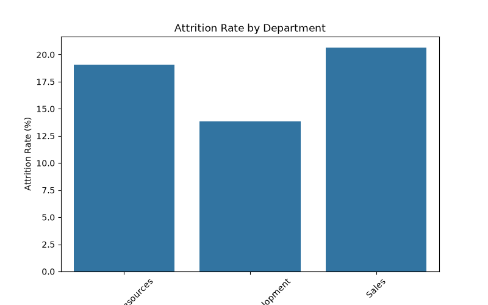
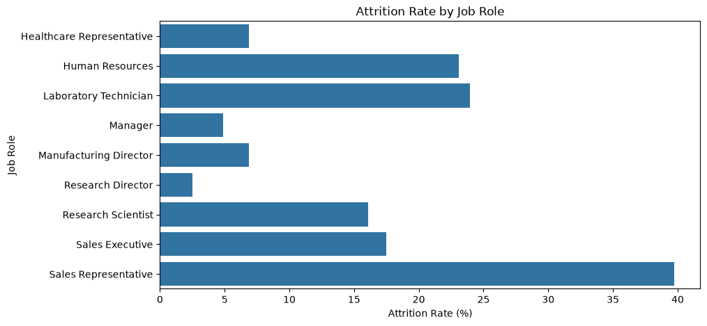
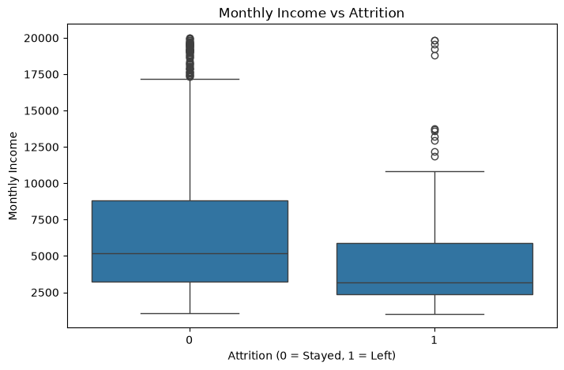
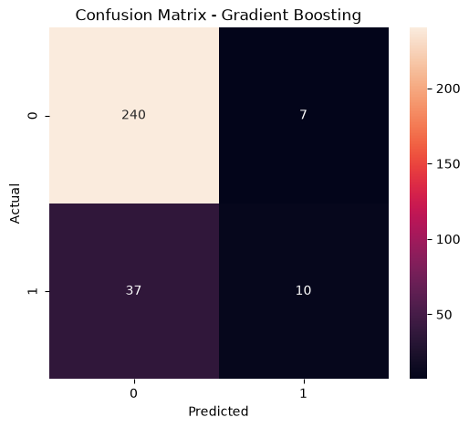
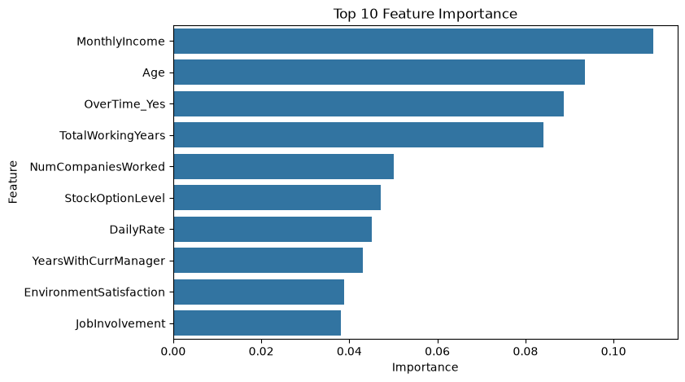

# Employee Attrition Prediction 📊

## Project Overview

This project uses Machine Learning to predict whether an employee is likely to leave an organization based on HR data.

The project includes:
- Data cleaning
- Exploratory Data Analysis
- Feature engineering
- Classification models
- Model evaluation
- Business recommendations

## Models Used

- Logistic Regression
- Random Forest Classifier
- Gradient Boosting Classifier

## Best Model

Gradient Boosting Classifier

Accuracy:
85%

ROC-AUC:
0.79

## Key Findings

- Monthly Income is the strongest factor affecting attrition.
- Overtime employees show higher chances of leaving.
- Sales Representatives have the highest attrition rate.
- Employee satisfaction and involvement influence retention.

## Visualizations

### Attrition by Department

### Attrition by Job Role

### Income vs Attrition

### Confusion Matrix

### Feature Importance

## Files

- analysis.ipynb → Complete analysis notebook
- HR_Attrition.csv → Dataset
- summary.docx → Business summary
- charts → Generated visualizations

## Tools Used

Python | Pandas | Scikit-learn | Matplotlib | Seaborn
